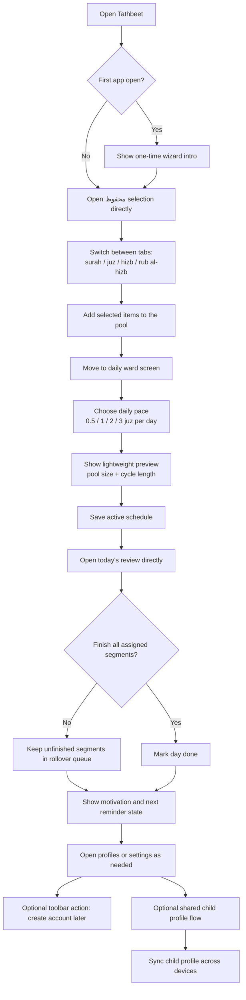

# Tathbeet MVP User Flow

This flow focuses on the Android MVP that you asked for: offline-first review, optional Google sign-in, multiple profiles, shared child profiles, and an Arabic-first RTL prototype.

## Flow Notes

- The first app open shows a one-time wizard intro screen, then moves into the schedule setup flow.
- After that first intro has been seen, reopening the setup flow should start directly on the محفوظ selection screen.
- Account creation should not block the first-run flow; it can be offered later from the toolbar.
- The setup wizard should have three screens: intro once, محفوظ selection, then daily ward.
- Memorized-pool selection should happen in its own dedicated screen, not inside the daily-ward screen.
- The daily-ward screen should stay lightweight and answer only: how large is the pool, and how long is one full rotation.
- The daily-ward screen should stay visually focused and avoid extra blocks that do not help the user finish setup.
- Guests can use the app fully for local profile management and offline revision.
- Signed-in users unlock sync and shared child profile management.
- Daily review is intentionally simple: see due items, mark segments done, and let missed work roll over.
- The prototype should use Arabic-only visible copy and should render in RTL even when tested on a non-Arabic device.
- Prototype strings should live in Android XML resources so copy review and later localization stay manageable.
