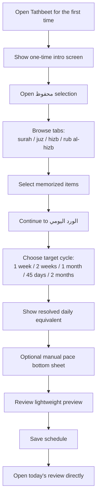
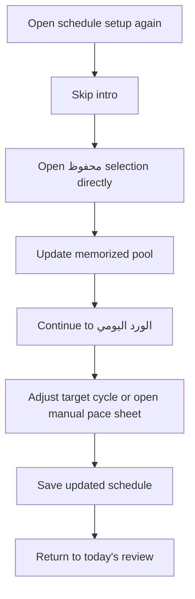
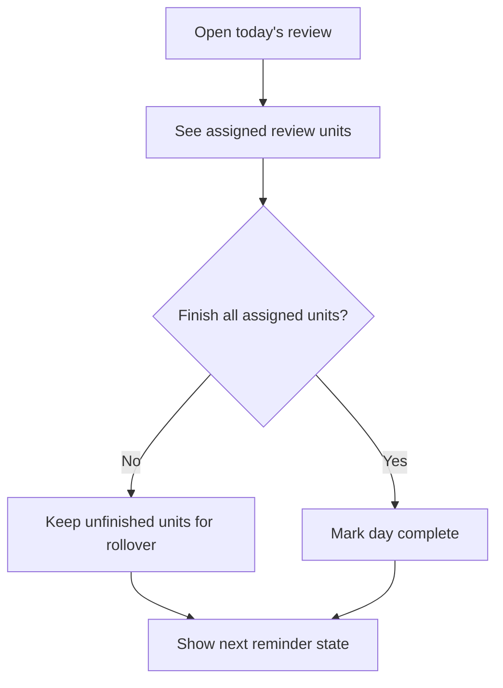
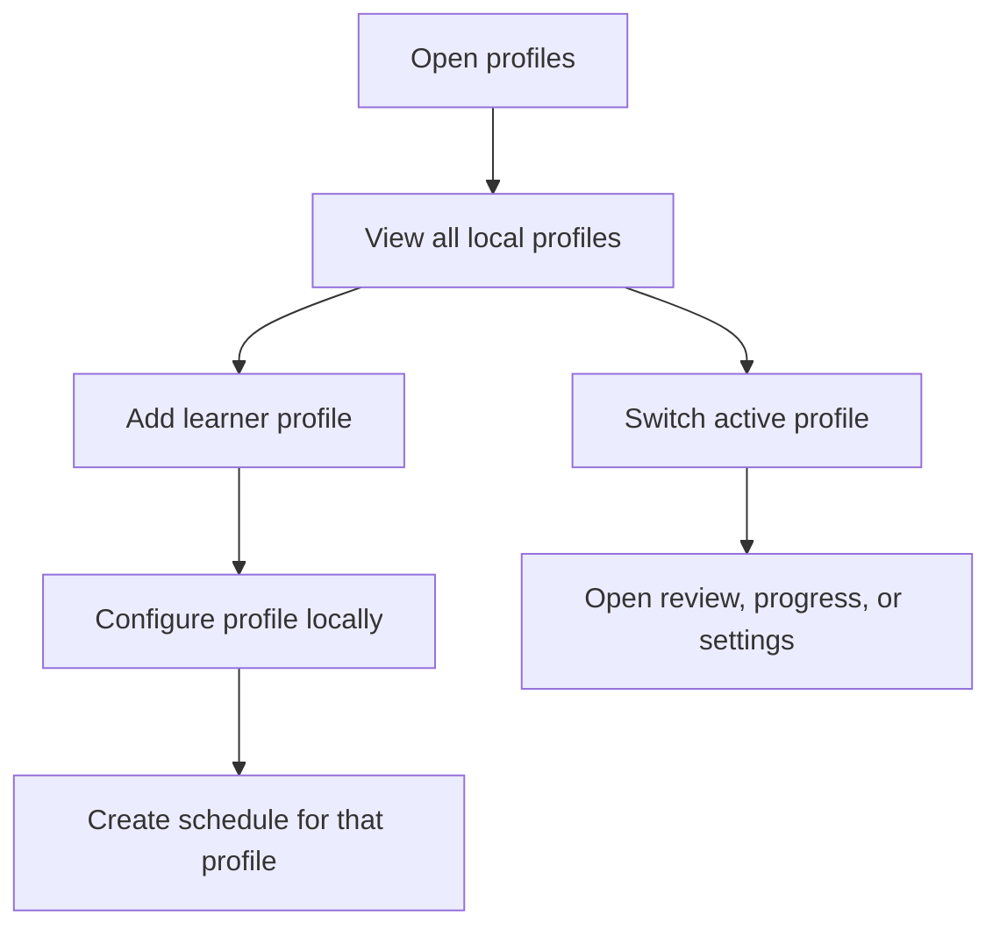
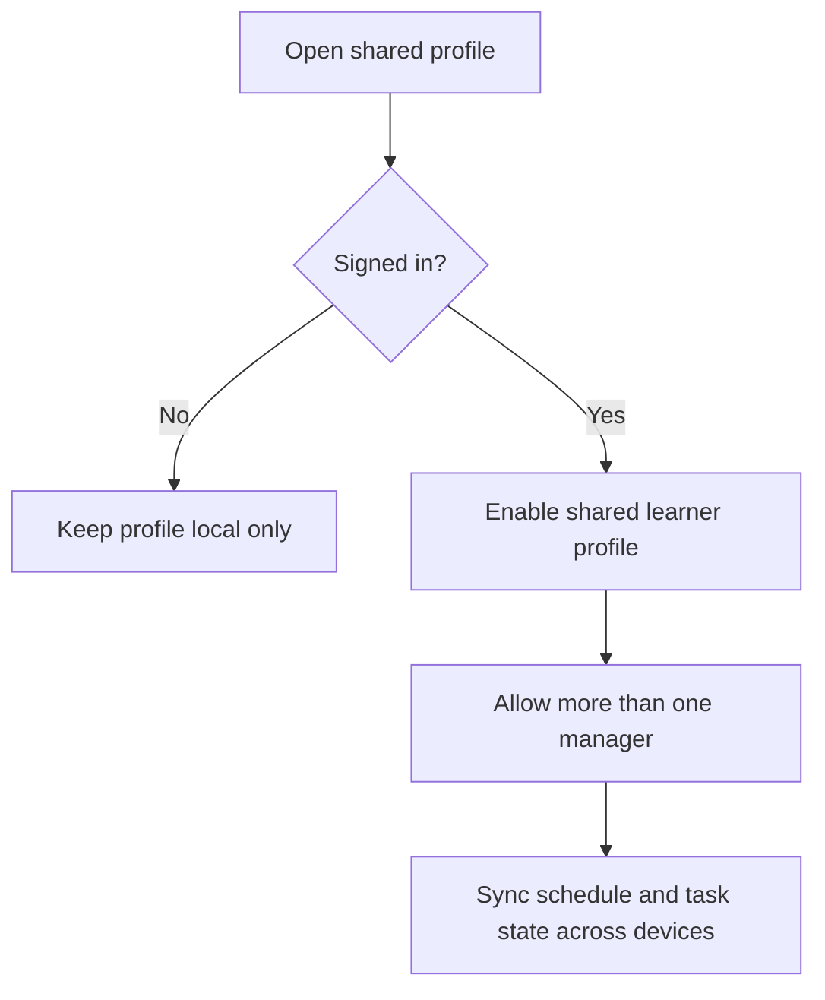
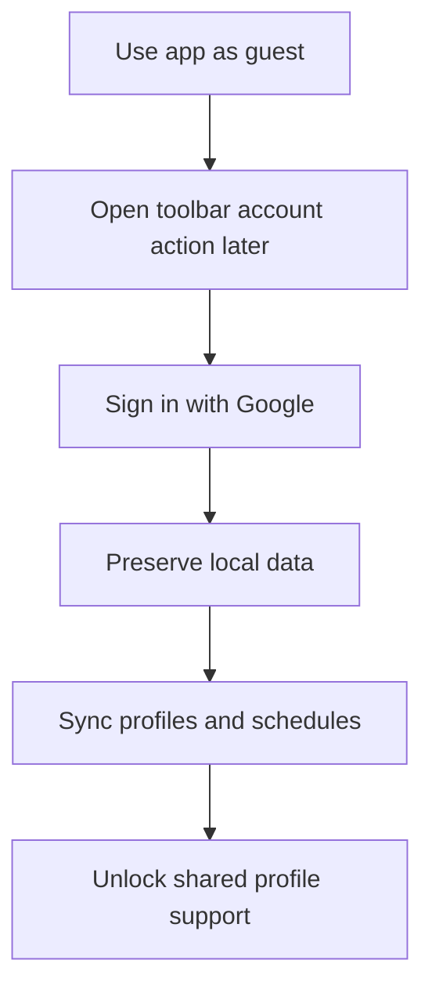

# Tathbeet MVP User Flows

This document splits the MVP into separate user journeys so each flow stays focused and reviewable.

## 1. Onboarding And First Schedule Setup

Notes:
- The intro screen appears only once.
- Account creation should not block this flow.
- The pool should display what the user selected, while overlap handling stays internal to the scheduler.
- The pace step should default to cycle-based setup rather than manual daily-unit selection.

## 2. Reopening Schedule Setup Later

Notes:
- After the first run, setup should always start from محفوظ selection.
- The daily-ward screen should stay simple and focused.

## 3. Daily Ward And Review

Notes:
- Review is intentionally simple in MVP.
- The engine should count partial overlap once when building effective coverage.
- Missed work rolls over instead of being dropped.

## 4. Add And Manage Profiles

Notes:
- Profiles should support self and additional learners.
- This flow should work offline.

## 5. Shared Learner Profile

Notes:
- Shared access is optional.
- Shared profile wording should stay role-neutral and support family or class use cases.

## 6. Create Account Later

Notes:
- Guest usage is valid in MVP.
- Sign-in should enhance the product, not block first use.

## Flow Rules

- The prototype should use Arabic-only visible copy.
- The prototype should render in RTL even on non-Arabic devices.
- User-facing strings should live in Android XML resources.
- The محفوظ selection screen should keep its top area fixed and scroll only the list below.
- Category switching in محفوظ selection should support both tab taps and horizontal swiping.
- The pool keeps exact user selections.
- Full containment should be resolved internally by keeping the larger effective coverage.
- Partial overlap should be resolved internally by counting shared coverage once.
- The pace step should default to target cycle presets and keep manual pace in a secondary bottom sheet.
- Manual pace and target-cycle pace should behave as two exclusive step states, not two visible sections at once.
