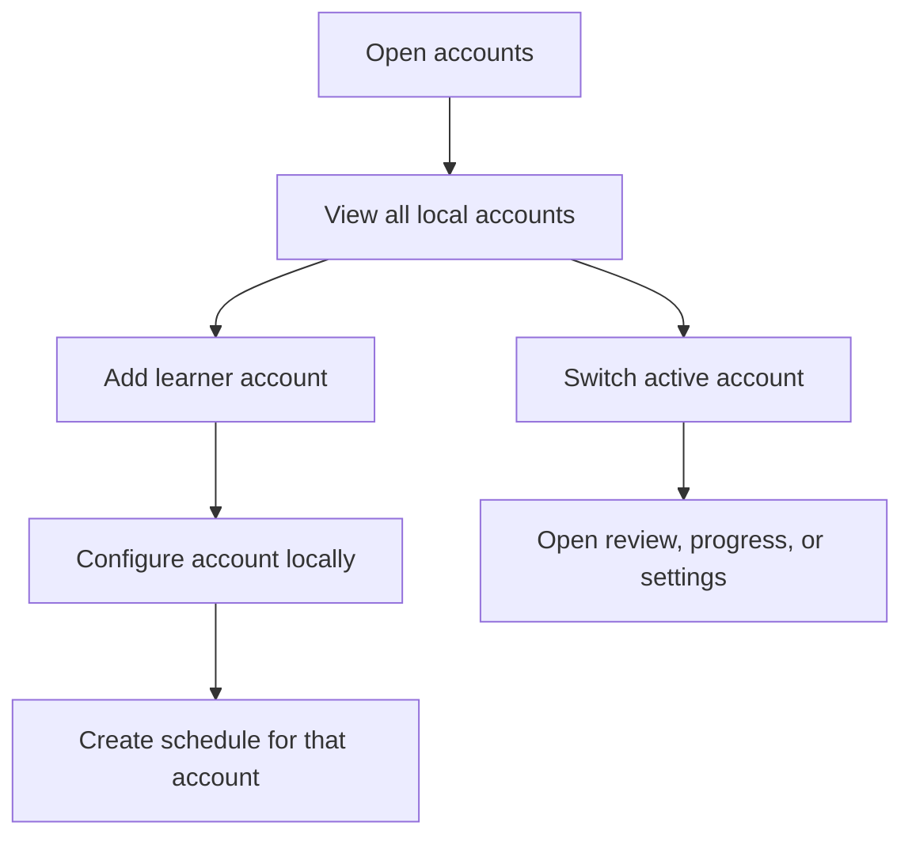

# Add And Manage Accounts

```mermaid
flowchart TD
    A["Open accounts"] --> B["View all local accounts"]
    B --> C["Add learner account"]
    B --> D["Switch active account"]
    C --> E["Configure account locally"]
    E --> F["Create schedule for that account"]
    D --> G["Open review, progress, or settings"]
```

Notes:
- Accounts should support self and additional learners.
- This flow should work offline.
