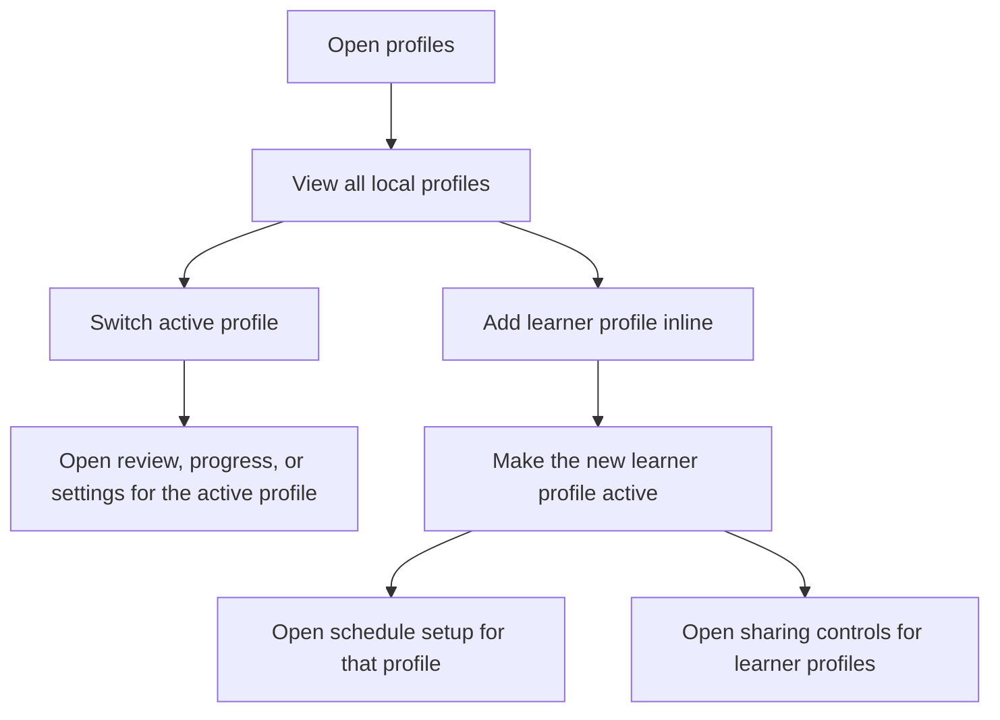

# Add And Manage Profiles

Notes:
- Profiles should support self and additional learners on one device.
- This flow should work offline.
- The current prototype keeps profile creation inline from the Profiles screen.
- Edit and delete profile flows remain PRD requirements, but they are not yet represented as dedicated prototype screens.
