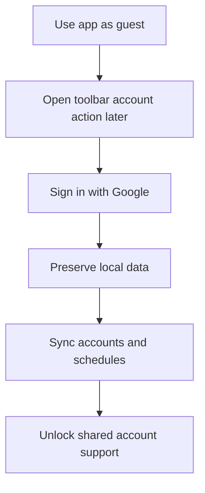

# Create Account Later

```mermaid
flowchart TD
    A["Use app as guest"] --> B["Open toolbar account action later"]
    B --> C["Sign in with Google"]
    C --> D["Preserve local data"]
    D --> E["Sync accounts and schedules"]
    E --> F["Unlock shared account support"]
```

Notes:
- Guest usage is valid in MVP.
- Sign-in should enhance the product, not block first use.
