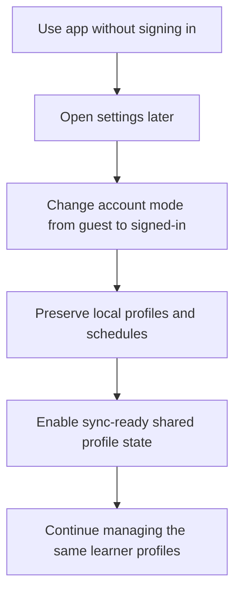

# Create Account Later

Notes:
- Guest usage is valid in MVP.
- Sign-in should enhance the product, not block first use.
- The current prototype simulates sign-in locally from Settings rather than a toolbar action.
