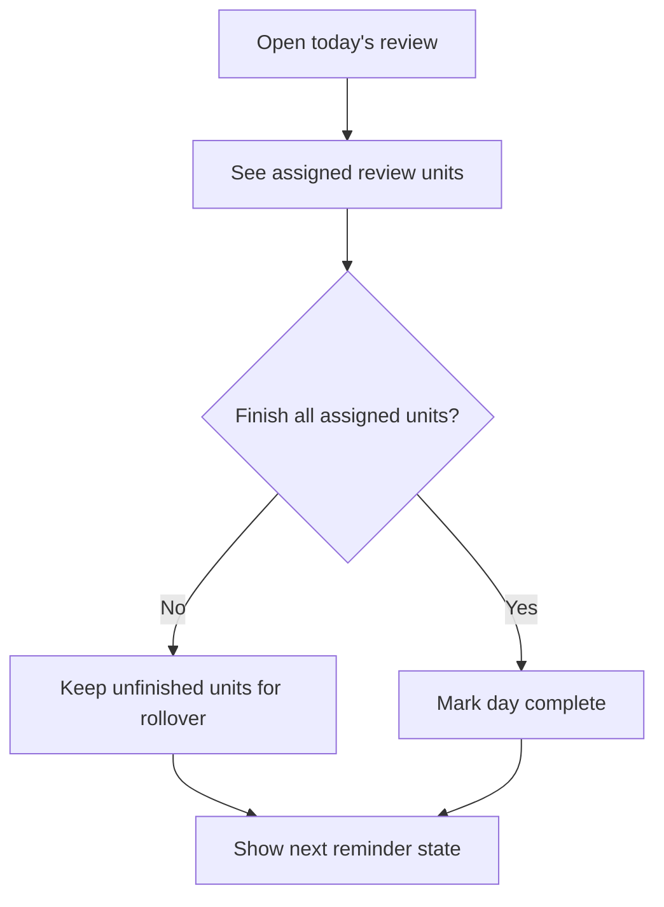

# Daily Ward And Review

Notes:
- Review is intentionally simple in MVP.
- The engine should count partial overlap once when building effective coverage.
- Missed work rolls over instead of being dropped.
