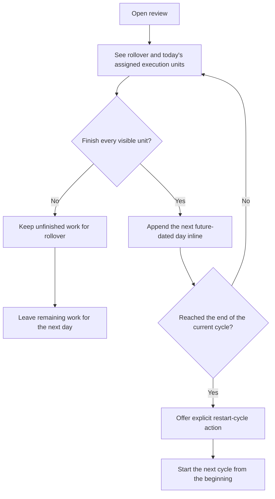

# Daily Ward And Review

Notes:
- Review should stay structurally simple even when future days are appended inline.
- The active local profile should be visible in the review top bar title.
- The review screen should also expose plan editing from the top app bar.
- Missed work rolls over instead of being dropped.
