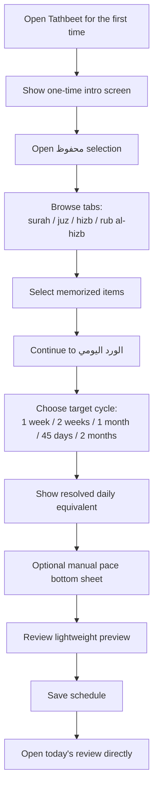

# Onboarding And First Schedule Setup

Notes:
- The intro screen appears only once.
- Account creation should not block this flow.
- The pool should display what the user selected, while overlap handling stays internal to the scheduler.
- The pace step should default to cycle-based setup rather than manual daily-unit selection.
