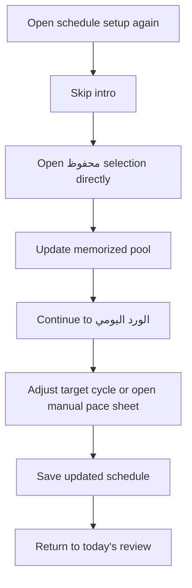

# Reopening Schedule Setup Later

```mermaid
flowchart TD
    A["Open schedule setup again"] --> B["Skip intro"]
    B --> C["Open محفوظ selection directly"]
    C --> D["Update memorized pool"]
    D --> E["Continue to الورد اليومي"]
    E --> F["Adjust target cycle or open manual pace sheet"]
    F --> G["Save updated schedule"]
    G --> H["Return to today's review"]
```

Notes:
- After the first run, setup should always start from محفوظ selection.
- The daily-ward screen should stay simple and focused.
