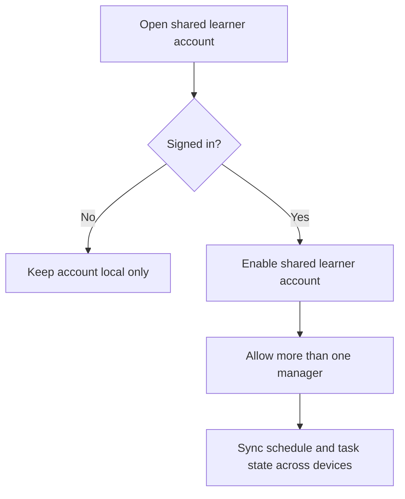

# Shared Learner Account

```mermaid
flowchart TD
    A["Open shared learner account"] --> B{"Signed in?"}
    B -- "No" --> C["Keep account local only"]
    B -- "Yes" --> D["Enable shared learner account"]
    D --> E["Allow more than one manager"]
    E --> F["Sync schedule and task state across devices"]
```

Notes:
- Shared access is optional.
- Shared account wording should stay role-neutral and support family or class use cases.
