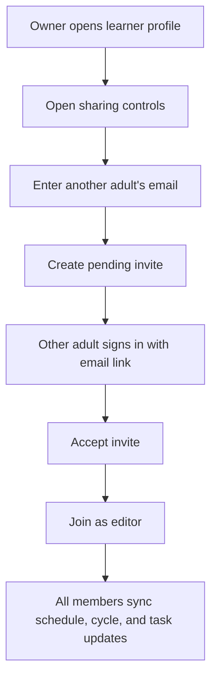

# Shared Learner Account

Notes:
- Shared access is optional.
- The original creator is the only owner in MVP.
- Invited adults join as editors and can fully update the revision plan and daily tasks.
- The current prototype simulates sharing state and sync feedback locally.
